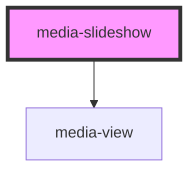

# media-slideshow

<!-- Auto Generated Below -->

## Properties

| Property                  | Attribute                   | Description                                                                                                                                                                                                         | Type                 | Default     |
| ------------------------- | --------------------------- | ------------------------------------------------------------------------------------------------------------------------------------------------------------------------------------------------------------------- | -------------------- | ----------- |
| `fit`                     | `fit`                       | (optional) The kind of "object-fit" to use for the images/videos. Can be contian, cover, fill, none, scale-down or pan.                                                                                             | `string`             | `"pan"`     |
| `hideControlsTime`        | `hide-controls-time`        | (optional) The number of seconds of inaction after which the controls are hidden. Set to 0 to always hide the controls. Set to Infinity to never hide them.                                                         | `number`             | `4`         |
| `onexit`                  | `onexit`                    | (optional) Set to a value to make the exit button appear in the controls. Accepted values are a url to navigate to or a callback function to call when exit is clicked.                                             | `any`                | `null`      |
| `panMinVisible`           | `pan-min-visible`           | (optional) The minimum percentage of the media surface that is garanteed to be visible at any point during the panning.                                                                                             | `number`             | `80`        |
| `repeat`                  | `repeat`                    | (optional) Initial value of the repeat button. If true, the slideshow will loop back to the beginning after the last slide.                                                                                         | `boolean`            | `true`      |
| `slideBufferSize`         | `slide-buffer-size`         | (optional) The number of extra slides that are loading in the background, excluding the current and previous slides.                                                                                                | `number`             | `3`         |
| `slideTransitionDuration` | `slide-transition-duration` | (optional) The number of seconds the transition from one slide to another takes.                                                                                                                                    | `number`             | `0.5`       |
| `sourceUrls`              | `source-urls`               | The source urls of all the media (images/videos) in this slideshow. Accepts an array of strings when set from code, or a whitespace-separated list of urls (no quotes) when using the attribute directly from html. | `string \| string[]` | `undefined` |
| `speedOneSlideTime`       | `speed-one-slide-time`      | (optional) The number of seconds a slide is shown on speed 1.                                                                                                                                                       | `number`             | `5`         |
| `speedThreeSlideTime`     | `speed-three-slide-time`    | (optional) The number of seconds a slide is shown on speed 3.                                                                                                                                                       | `number`             | `1.5`       |
| `speedTwoSlideTime`       | `speed-two-slide-time`      | (optional) The number of seconds a slide is shown on speed 2.                                                                                                                                                       | `number`             | `3`         |

## Dependencies

### Depends on

- media-view

### Graph

----------------------------------------------

*Built with [StencilJS](https://stenciljs.com/)*
